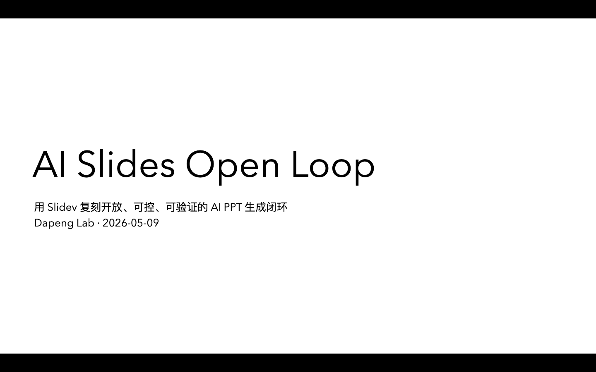

# slidev-agent-loop

An open, reproducible AI PPT generation loop built on Slidev.

这个项目来自一次对 Manus Slides / PPT 生成链路的复刻实验。它不复刻 Manus 的私有协议，也不假装等于 Manus；它验证的是一条更开放的链路：

```text
structured outline
-> generate slides.md
-> Slidev preview / build
-> export PNG / PDF / PPTX
-> verify outputs
```

核心想法很简单：AI 不直接修改 PPTX，而是先生成结构化的 `outline.json`，再由脚本转换成 Slidev 真正读取的 `slides.md`。

## What This Includes

```text
outline.json                         # 自定义的结构化输入，不是 Slidev 官方格式
slides.md                            # Slidev 原生入口，由 generate 脚本生成
scripts/open-slidev-loop.mjs          # generate / present / verify 的工程脚本
registry.json                        # 本地项目状态记录
exports/verify-report.json            # 最近一次机器校验报告
exports/png/*.png                     # 示例 PNG 导出
exports/deck.pdf                      # 示例 PDF 导出
exports/deck.pptx                     # 示例 PPTX 导出
screenshots/preview-home.png          # 本地预览截图
```

`dist/` 和 `node_modules/` 不需要提交。它们可以通过命令重新生成。

## Why `outline.json`

`outline.json` 不是 Slidev 自带文件。它是这个 demo 自己定义的 AI 输入协议。

它分两层：

```text
outline.json
├─ project-level metadata
│  ├─ project_id
│  ├─ title
│  ├─ subtitle
│  ├─ author
│  ├─ date
│  └─ theme
│
└─ slides[]
   ├─ slide 1
   ├─ slide 2
   └─ ...
```

项目级信息示例：

```json
{
  "project_id": "docpilot-slidev-open-loop",
  "title": "AI Slides Open Loop",
  "subtitle": "用 Slidev 复刻开放、可控、可验证的 AI PPT 生成闭环",
  "author": "Dapeng Lab",
  "date": "2026-05-09",
  "theme": "default"
}
```

单页 slide 示例：

```json
{
  "id": "problem",
  "layout": "bullets",
  "title": "问题：AI PPT 不能只是一次性生成",
  "summary": "真正可用的 AI PPT 系统需要可编辑、可预览、可导出、可验证。",
  "bullets": [
    "二进制 PPTX 难以被 Agent 精确 diff 和增量修复",
    "纯 HTML 托管缺少项目生命周期和导出闭环",
    "黑盒平台能力强，但迁移和调试成本高"
  ]
}
```

这层结构的作用是让 AI 只负责填内容和结构，脚本负责把它翻译成 Slidev 能运行的 Markdown。

## How It Works

`npm run generate` 不是 Slidev 官方命令。它是本项目在 `package.json` 里注册的一层转换脚本：

```json
{
  "scripts": {
    "generate": "node scripts/open-slidev-loop.mjs generate"
  }
}
```

转换过程：

```text
outline.json
-> scripts/open-slidev-loop.mjs generate
-> slides.md
-> Slidev
```

核心逻辑是根据每页的 `layout` 选择不同的渲染函数：

```js
function renderSlide(outline, slide, index) {
  const body = {
    cover: () => renderCover(outline, slide),
    bullets: () => renderBullets(slide),
    mermaid: () => renderMermaid(slide),
    table: () => renderTable(slide),
  }[slide.layout || "bullets"]?.() || renderBullets(slide);

  return `${body}
<!--
Slide ${index + 1}: ${slide.summary}
-->`;
}
```

然后把所有页面用 Slidev 的分页符拼起来：

```js
const slideBodies = outline.slides.map((slide, index) =>
  renderSlide(outline, slide, index)
);

const slides = `${renderFrontmatter(outline)}${slideBodies.join("\n\n---\n\n")}`;
```

生成出来的 `slides.md` 才是 Slidev 真正读取的文件。

## Quick Start

Install dependencies:

```bash
npm install
```

Generate `slides.md` from `outline.json`:

```bash
npm run generate
```

Build static preview:

```bash
npm run build
```

Start local preview:

```bash
npm run present
```

Default preview URL:

```text
http://localhost:4185/
```

Export files:

```bash
npm run export:png
npm run export:pdf
npm run export:pptx
```

Run verification:

```bash
npm run verify
```

## Outputs

Current demo outputs:

```text
exports/png/1.png ... exports/png/7.png
exports/deck.pdf
exports/deck.pptx
exports/verify-report.json
```

Preview screenshot:



Example verification report:

```json
{
  "outline_slide_count": 7,
  "generated_slides_md": true,
  "dist_exists": true,
  "exports": {
    "png_count": 7,
    "pdf_exists": true,
    "pptx_exists": true
  },
  "ok": true
}
```

## Local vs Cloud

This repo currently runs locally:

```text
local filesystem
-> Node runtime
-> localhost preview
-> local exports
```

In a cloud production setup, the same shape can be hosted inside a task sandbox:

```text
API creates a task
-> sandbox starts a Slidev workspace
-> AI writes outline.json or slides.md
-> sandbox runs build / preview / export
-> preview proxy exposes a URL
-> object storage keeps PNG / PDF / PPTX / verify-report
```

So the boundary is:

```text
Slidev: content, rendering, preview, export
Engineering layer: state, AI workflow, verification, sandbox lifecycle
```

## Notes

- `outline.json` is custom to this repo.
- `slides.md` is the real Slidev entry file.
- `registry.json` is only a transparent local state file, not a Slidev feature.
- PPTX export is supported by Slidev, but production use should still verify layout quality.
