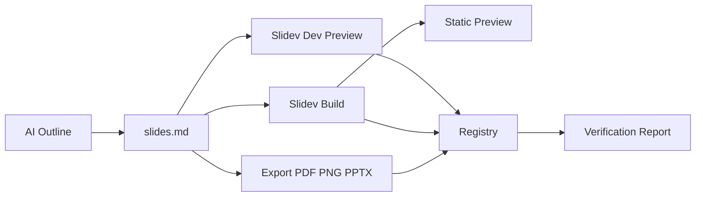

# AI Slides Open Loop

用 Slidev 复刻开放、可控、可验证的 AI PPT 生成闭环

Dapeng Lab · 2026-05-09

<!-- 从 Manus Slides 的黑盒机制，到 Slidev 的开放复刻。 -->
<!--
Slide 1: 从 Manus Slides 的黑盒机制，到 Slidev 的开放复刻。
-->

---

# 问题：AI PPT 不能只是一次性生成

真正可用的 AI PPT 系统需要可编辑、可预览、可导出、可验证。

- 二进制 PPTX 难以被 Agent 精确 diff 和增量修复
- 纯 HTML 托管缺少项目生命周期和导出闭环
- 黑盒平台能力强，但迁移和调试成本高
<!--
Slide 2: 真正可用的 AI PPT 系统需要可编辑、可预览、可导出、可验证。
-->

---

# Manus 给出的工程启示

Manus Slides 的关键不是某个开源框架，而是 artifact 生命周期。

- 文件层：slide_state.json + 每页 HTML
- 注册层：available slide projects 白名单
- 预览层：slide_present 返回 manus-slides:// 链接
- 状态层：只有 edited slide 才能进入预览
<!--
Slide 3: Manus Slides 的关键不是某个开源框架，而是 artifact 生命周期。
-->

---

# 开放复刻：Slidev + Registry + Sandbox

用公开工具复刻 Manus 的工程思想，而不是复刻私有协议。

<!--
Slide 4: 用公开工具复刻 Manus 的工程思想，而不是复刻私有协议。
-->

---

# 开放 Registry：把白名单变成透明元数据

我们保留注册层，但不做隐藏状态。

| 字段 | 作用 | Manus 对照 |
| --- | --- | --- |
| project_id | 项目身份 | presentation/project id |
| project_dir | 可迁移路径 | project_dir |
| entry | Slidev 源文件 | 每页 HTML + state |
| preview_url | 本地或沙箱预览 | manus-slides:// |
| exports | PDF/PNG/PPTX 产物 | 附件导出 |
<!--
Slide 5: 我们保留注册层，但不做隐藏状态。
-->

---

# 验证闭环：让生成结果可被机器检查

AI 生成之后，系统必须能自己判断产物是否可用。

- 校验 outline 与 slides.md 页数一致
- 校验资源路径存在且可读取
- 构建 dist 并启动静态预览
- 截图检查非空画面
- 导出 PNG/PDF/PPTX 并记录产物
<!--
Slide 6: AI 生成之后，系统必须能自己判断产物是否可用。
-->

---

# 结论：PPT 应该成为可执行工程对象

Slidev 让开放实现变得足够简单，Manus 让我们看清注册层的重要性。

- Manus 证明了 Web Slides + 沙箱 + 注册层的产品价值
- Slidev 提供了开放、可迁移、可调试的实现底座
- AI 负责生成结构化内容，代码负责验证和交付
<!--
Slide 7: Slidev 让开放实现变得足够简单，Manus 让我们看清注册层的重要性。
-->

